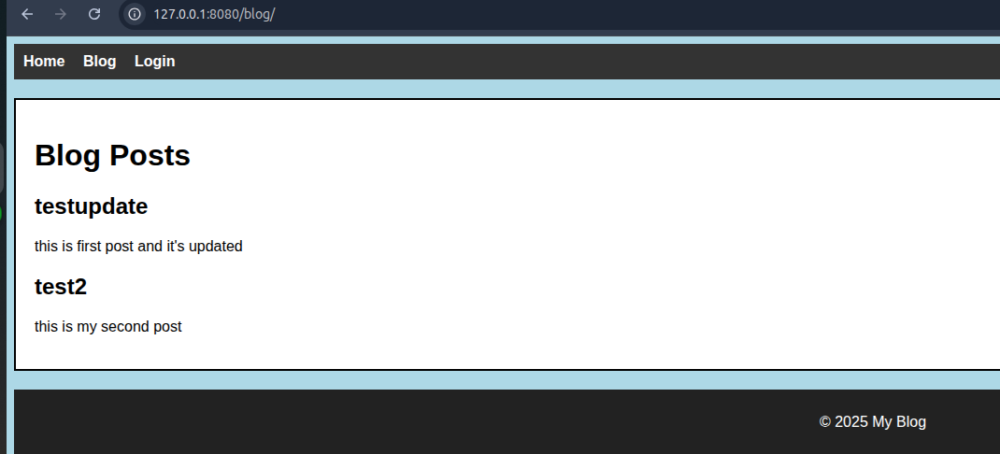
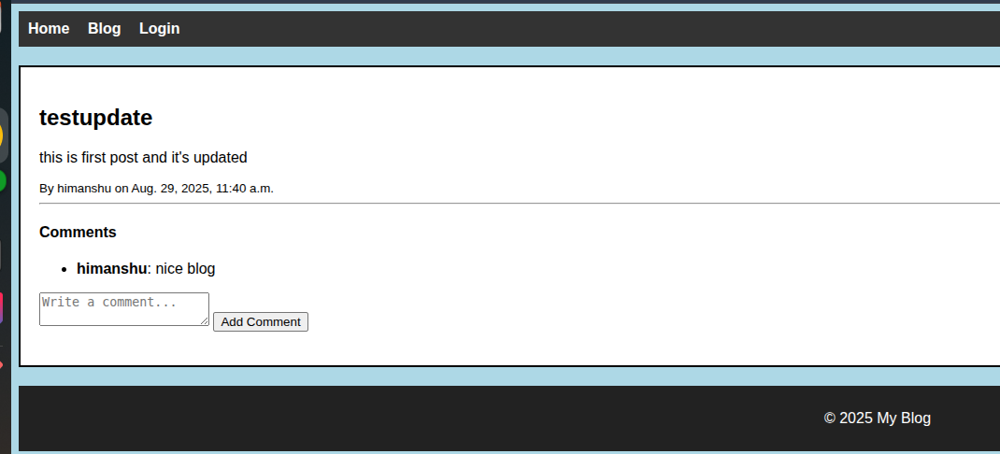
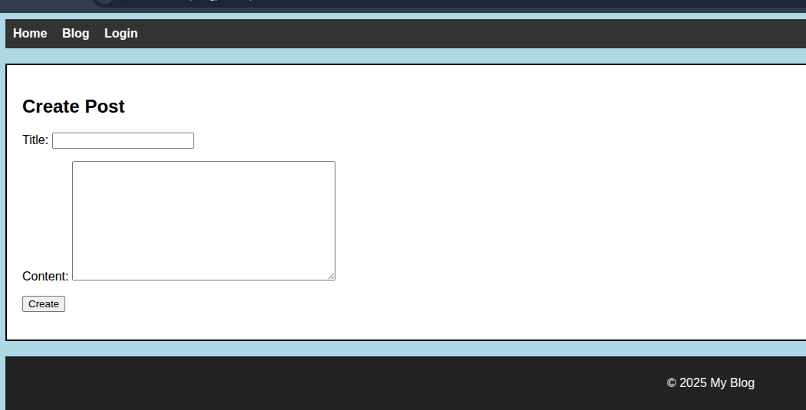
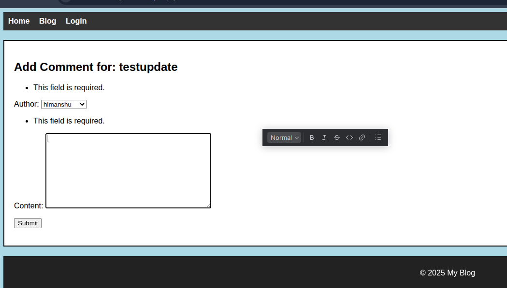

# 📝 Django Blog Project with Comments

A simple **Django Blog Application** with **CRUD operations for Posts** and a **Comment System**.  
This project demonstrates Django basics like Models, Views, Templates, Forms, and Database migrations.

---

## 🚀 Features
- ✅ Blog Post CRUD (Create, Read, Update, Delete)
- ✅ Comments on Blog Posts
- ✅ Django ModelForms for form handling
- ✅ Template Inheritance (`base.html`)
- ✅ Database Integration (SQLite by default)
- ✅ Error handling & migration setup

---

## 🏗️ Project Structure
```
django_blog_project_test/
│── blog_app/          # Handles blog posts
│   ├── models.py      # Post model
│   ├── views.py       # CRUD views
│   ├── forms.py       # PostForm
│   └── templates/
│       └── blog_app/
│           ├── post_list.html
│           ├── post_detail.html
│           ├── post_form.html
│           └── post_confirm_delete.html
│
│── comments_app/      # Handles comments
│   ├── models.py      # Comment model
│   ├── views.py       # Add comment view
│   ├── forms.py       # CommentForm
│   └── templates/
│       └── comments_app/
│           └── comment_form.html
│
│── templates/
│   └── base.html      # Common layout
│
│── static/            # CSS, JS, images
│── manage.py
```

---

## ⚙️ Installation & Setup

1️⃣ Clone the repository
```bash
git clone https://github.com/yourusername/django-blog-comments.git
cd django-blog-comments
```

2️⃣ Create and activate virtual environment
```bash
python -m venv venv
source venv/bin/activate   # Linux/Mac
venv\Scripts\activate    # Windows
```

3️⃣ Install dependencies
```bash
pip install -r requirements.txt
```

4️⃣ Run migrations
```bash
python manage.py makemigrations
python manage.py migrate
```

5️⃣ Create superuser (optional)
```bash
python manage.py createsuperuser
```

6️⃣ Run the server
```bash
python manage.py runserver
```

---

## 🌐 Usage

- Visit `http://127.0.0.1:8000/` → Blog home page (list of posts).
- Click on a post → View post details + comments.
- Add/Edit/Delete posts (if logged in).
- Add comments to posts.

---

## 📸 Screenshots
- 🏠 **Post List Page** → Shows all posts.
- 
- 📖 **Post Detail Page** → Shows post content + comments.
- 
- ✍️ **Post Form** → Create/Update a post.
- 
- 💬 **Comment Form** → Add comments on posts.
- 

---

## 🛠️ Tech Stack
- **Backend** → Django 5.x
- **Database** → SQLite (default, can be changed)
- **Frontend** → HTML, CSS (with static files)

---

## 🐛 Common Issues

❌ `no such table: comments_app_comment`  
✔️ Fix: Run
```bash
python manage.py makemigrations
python manage.py migrate
```

---

## 📌 Future Improvements
- 🔐 Add authentication (only logged-in users can post).
- 🎨 Add Bootstrap/Tailwind for styling.
- 🗂️ Pagination for posts and comments.
- ⭐ Like/Dislike functionality.

---

## 👤 Author
- **Himanshu Changil**  
  Python & DevOps Enthusiast 🚀